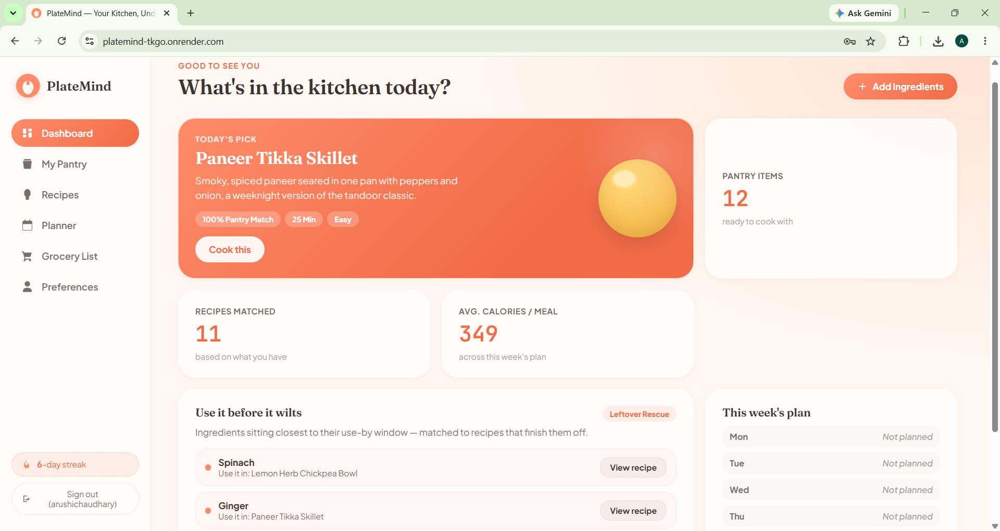
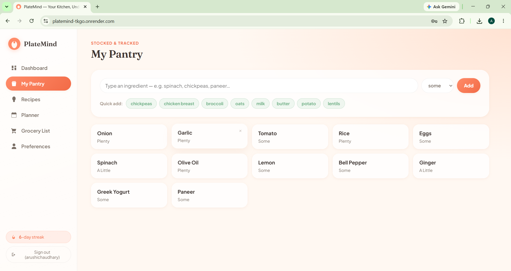
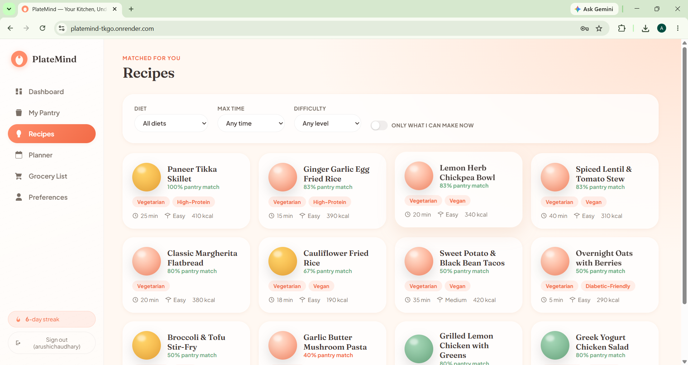
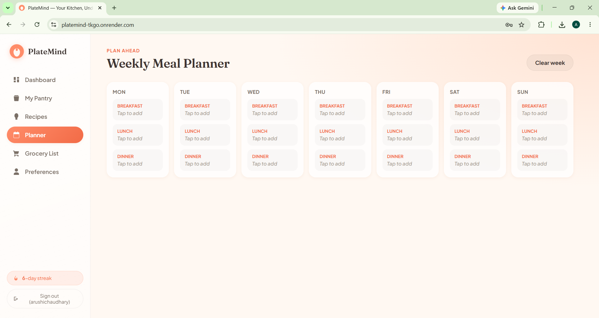
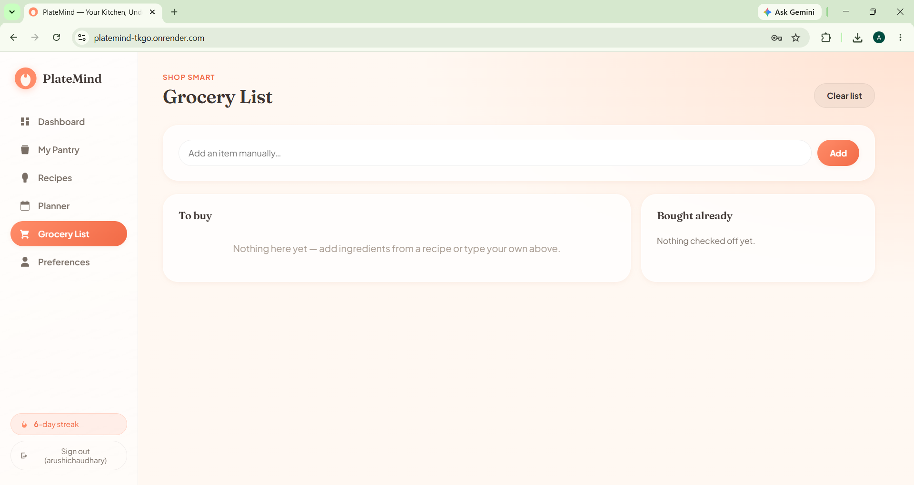
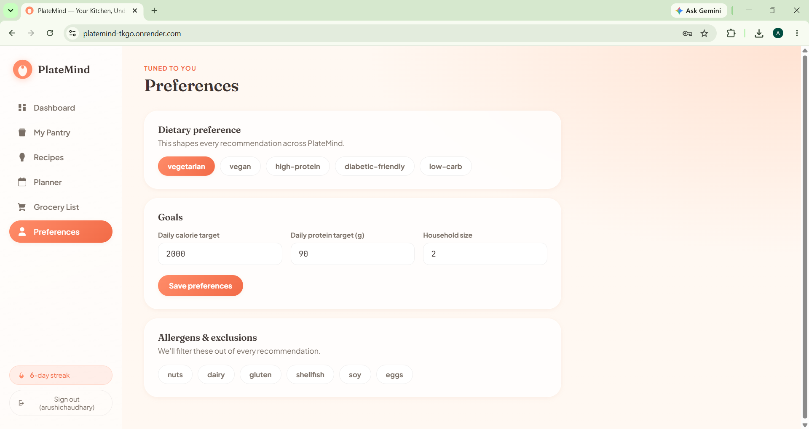

# PlateMind — Smart Nutrition & Recipe Recommendation App

PlateMind is a small full-stack web app that recommends recipes based on what's in your pantry, your dietary preferences, and your nutrition goals. A lightweight Node/Express server sits in front of the app and requires users to create an account (username + password) before they can access it.

**Live Demo:** [platemind-tkgo.onrender.com](https://platemind-tkgo.onrender.com)

## Screenshots

<p align="center">
  
</p>

<p align="center">
  
  
</p>

<p align="center">
  
  
</p>

<p align="center">
  
</p>

## Features

- **Dashboard** — today's top recipe pick, quick stats (pantry items, recipes matched, avg. calories/meal), a "use it before it wilts" leftover-rescue panel, and a mini view of the week's meal plan
- **My Pantry** — add/remove ingredients you have at home, with quantity tags (Plenty / Some / A Little) and quick-add shortcuts for common items
- **Recipes** — filterable by diet, max time, and difficulty, with an "only what I can make now" toggle; each card shows a pantry-match percentage
- **Meal Planner** — a 7-day × 3-meal interactive planner
- **Grocery List** — auto-fills from missing recipe ingredients, with manual add and a "bought already" section
- **Preferences** — dietary preference, daily calorie/protein goals, household size, and allergen exclusions that filter every recommendation

## Authentication

A tiny Node/Express server sits in front of the original static app and requires users to sign up (username + password) before reaching it.

- Passwords are hashed with **bcrypt**
- User accounts are stored in a plain `users.json` file; sessions in a plain file store — deliberately pure JavaScript, so no native compiler or Visual Studio Build Tools are needed to install dependencies on Windows
- Sessions use **httpOnly** cookies (not readable by JS, which helps against XSS token theft) and are marked `secure` in production, so they only work over HTTPS (which Render provides automatically)

**Routes:**

| Route | Method | Description |
|---|---|---|
| `/api/register` | POST | `{ username, password }` → creates account, logs you in |
| `/api/login` | POST | `{ username, password }` → logs you in |
| `/api/logout` | POST | Ends your session |
| `/api/me` | GET | Returns the current logged-in user |
| `/` | GET | Serves the app, or redirects to `/login.html` if you aren't signed in |

## Project Structure

```
platemind/
├── server.js          # Express server: auth routes + serves the app
├── package.json       # Backend dependencies
├── render.yaml         # One-click Render deploy config (optional)
├── public/             # The original app (index.html, app.js, data.js, styles.css)
├── public-auth/
│   └── login.html      # Sign in / create account page
├── dashboard.png        # README screenshot
├── pantry.png            # README screenshot
├── recipes.png            # README screenshot
├── planner.png              # README screenshot
├── grocery-list.png           # README screenshot
└── preferences.png              # README screenshot
```

## Running It Locally

1. Install Node.js 18+ if you don't have it.
2. In this folder, run:
   ```bash
   npm install
   npm start
   ```
3. Open `http://localhost:3000` — you'll land on the sign-in page. Click "Create an account," pick a username (3–20 chars, letters/numbers/underscore) and a password (8+ chars), and you're in.

A `users.json` file (and a `sessions/` folder) will appear in this folder — that's your local database of users/sessions. Delete them any time to start fresh.

## Deploying on Render

**Option A — `render.yaml` (recommended):**
1. Push this folder to a GitHub repo.
2. In Render: **New → Blueprint** → pick the repo. Render reads `render.yaml` and creates the service, a persistent disk (so user accounts survive deploys/restarts), and a random `SESSION_SECRET` automatically.
3. Deploy — that's it.

**Option B — manual web service:**
1. Push this folder to GitHub.
2. In Render: **New → Web Service** → connect the repo.
3. Build command: `npm install`. Start command: `npm start`.
4. Add environment variables:
   - `SESSION_SECRET` = any long random string
   - `NODE_ENV` = `production`
   - `DATA_DIR` = `/data`
5. Add a Persistent Disk, mount path `/data`, 1 GB is plenty. Without a persistent disk, Render's filesystem resets on every deploy/restart, wiping all accounts. The free Render plan doesn't include disks — if you're on the free tier, leave `DATA_DIR` unset and accept that accounts reset on redeploys, or upgrade to a paid plan for a disk.
6. Deploy.

## How the Recommendation Engine Works

`data.js` contains a transparent scoring engine (`scoreRecipe`) that ranks recipes by:

- Ingredient overlap with your pantry
- Fit with your selected diets
- Hard exclusion of anything matching your allergens
- Closeness to your per-meal calorie goal

It also powers ingredient-substitution suggestions and the "leftover rescue" feature for low-stock items.

## What's Not Included (By Design, To Keep This Simple)

- Password reset / "forgot password" flow
- Per-user saved pantry/preferences on the server — the pantry, meal plan, and grocery list still live only in the browser tab's memory. Persisting these per user across devices would mean adding a couple more tables (`pantry_items`, `preferences`) keyed by user ID, plus API routes for the frontend to read/write them
- Rate limiting on login attempts (worth adding before a real public launch, e.g. with `express-rate-limit`)

## Author

**Aarushi Chaudhary**
[GitHub](https://github.com/arushichaudhary)
